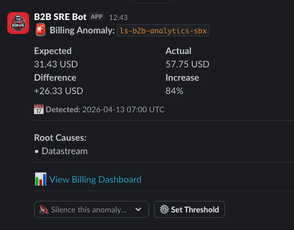

# ls-billing-anomaly-notification

> **Source code:** The Terraform module lives in the private [lightspeed-b2b/terraforming](https://gitlab.com/lightspeed-b2b/terraforming) repo under `modules/services/billing-anomaly-notification/`. This repo is the public-facing documentation.

A GCP Cloud Function that receives ML-based billing anomaly detection notifications via Pub/Sub and routes alerts to Slack channels based on regex patterns matching project names. Built and maintained by the B2B SRE team. **Supports multi-team routing** for shared billing accounts.



For more details on GCP billing anomaly detection: https://cloud.google.com/billing/docs/how-to/notify

## Contents

- [Getting alerts for your team](#getting-alerts-for-your-team)
- [Features](#features)
- [How it works](#regex-based-routing)
- [Silencing anomalies](#silencing-anomalies)
- [Per-project alert thresholds](#per-project-alert-thresholds)
- [Duplicate detection](#duplicate-detection-24-hour-per-channel-deduplication)
- [Usage (Terraform)](#usage)
- [Configuring GCP Billing Anomaly Detection](#configuring-gcp-billing-anomaly-detection)
- [Testing](#testing-function-locally)

## Getting alerts for your team

To receive billing anomaly alerts in your team's Slack channel, add your team's GCP projects and Slack channel to the [routing spreadsheet](https://docs.google.com/spreadsheets/d/14Sis-_roMMy_rEbF3cmgyz5bOsZZ7y5AqL-1Z-p7ZqM/edit?gid=0#gid=0).

The spreadsheet is the source of truth for which teams receive alerts and where. Each row maps a GCP project name pattern (regex) to a Slack channel. Once added, the B2B SRE team will update the Terraform config and deploy the change.

**To onboard your team:**
1. Open the [routing spreadsheet](https://docs.google.com/spreadsheets/d/14Sis-_roMMy_rEbF3cmgyz5bOsZZ7y5AqL-1Z-p7ZqM/edit?gid=0#gid=0)
2. Add a row with your GCP project name prefix(es) and target Slack channel
3. Make sure the B2B SRE bot is invited to your Slack channel
4. Reach out to the B2B SRE team to apply the change

## Features

- ✅ **ML-based anomaly detection** - Not simple budget thresholds
- ✅ **Multi-team routing** - Route alerts to different Slack channels based on project regex patterns
- ✅ **Root cause analysis** - See which services caused the spike
- ✅ **Multi-project billing accounts** - Each team gets alerts only for their projects
- ✅ **Per-channel deduplication** - 24-hour deduplication tracked per channel
- ✅ **Silence** - Suppress a specific anomaly for 48h / 72h / 7d / 14d via Slack dropdown
- ✅ **Per-project thresholds** - Configurable min deviation % and/or min dollar amount via Slack modal; persists in GCS
- ✅ **Audit log** - Threshold changes posted to a central channel with message deep links

## Usage

```hcl
module "billing_anomaly_notification" {
  source = "../../modules/billing-anomaly-notification"
  
  region = "us-west1"
  
  # Route anomalies to different Slack channels based on project regex patterns
  webhook_routes = [
    {
      channel     = "#team-a-billing"
      pattern     = "^(team-a-|project-a-).*$"
      webhook_url = "https://hooks.slack.com/services/YOUR/TEAM_A/WEBHOOK"
    },
    {
      channel     = "#team-b-billing"
      pattern     = "^(team-b-|project-b-).*$"
      webhook_url = "https://hooks.slack.com/services/YOUR/TEAM_B/WEBHOOK"
    },
  ]
  
  billing_account_id = "012345-ABCDEF-123456"  # Optional, for console links
  debug_enabled      = false
  
  labels = {
    business_unit = "platform"
    contact       = "platform-sre"
    environment   = "production"
  }
}
```

### Multi-Team Routing (Recommended for shared billing accounts)

```hcl
module "billing_anomaly_notification" {
  source = "../../modules/billing-anomaly-notification"
  
  region = "us-west1"
  
  webhook_routes = [
    {
      channel     = "#b2b-billing-notifications"
      pattern     = "^(ls-b2b-|nuorder-).*$"
      webhook_url = var.b2b_slack_webhook
    },
    {
      channel     = "#golf-billing-alerts"
      pattern     = "^(chronogolf|ls-infra-golf-).*$"
      webhook_url = var.golf_slack_webhook
    },
    {
      channel     = "#ecom-billing-alerts"
      pattern     = "^(ls-ecom-|ls-infra-ecom-).*$"
      webhook_url = var.ecom_slack_webhook
    },
  ]
  
  billing_account_id = var.billing_account_id
  
  labels = var.standard_labels
}
```

### With External PubSub Topic (Subscribe to existing topic)

If you have a centralized PubSub topic for billing anomaly notifications (e.g., managed in a data platform project), you can subscribe to it instead of creating a new one:

```hcl
module "billing_anomaly_notification" {
  source = "../../modules/billing-anomaly-notification"
  
  region = "us-west1"
  
  webhook_routes = [
    {
      channel     = "#billing-alerts"
      pattern     = "^(my-team-).*$"
      webhook_url = var.slack_webhook
    },
  ]
  
  billing_account_id = var.billing_account_id
  
  # Subscribe to external PubSub topic from another project
  external_pubsub_topic = "projects/ls-data-platform-prd/topics/billing-anomaly-notification"
  
  labels = var.standard_labels
}
```

**Benefits of using an external topic:**
- ✅ Centralized billing notification management
- ✅ Multiple functions can subscribe to the same topic
- ✅ No need to configure GCP Billing for each project separately

**Note:** The module will automatically grant the function's service account `roles/pubsub.subscriber` permission on the external topic.

## Outputs

The module outputs the Pub/Sub topic name and ID, which you'll need to configure in your GCP Budget Alert settings:

```
pubsub_topic_id   = "projects/PROJECT_ID/topics/billing-anomaly-notification-XXXXX"
pubsub_topic_name = "billing-anomaly-notification-XXXXX"
```

## Configuring GCP Billing Anomaly Detection

After deploying this module, configure GCP's Cost Anomaly Detection to send notifications to the Pub/Sub topic:

### Using GCP Console (Recommended)

1. Go to [Cloud Console > Billing > Cost Management > Anomaly Detection](https://console.cloud.google.com/billing/anomalies)
2. Select your billing account
3. Click "Enable Anomaly Detection" if not already enabled
4. Click "Manage Notifications"
5. Click "Add Pub/Sub Topic"
6. Select the topic created by this module (output from `pubsub_topic_name`)
7. Save

**Note:** Unlike budgets, anomaly detection is ML-based and automatically detects unusual spending patterns without manual threshold configuration.

## Testing Function Locally

```bash
export DEBUG=1
export WEBHOOK_ROUTES_CONFIG='[{"channel":"#test-channel","pattern":"^nuorder-.*$","webhook_index":0}]'
export SLACK_WEBHOOK_0="https://hooks.slack.com/services/YOUR/TEST/WEBHOOK"
export BILLING_ACCOUNT_ID="012345-ABCDEF-123456"
export GCP_PROJECT="nuorder-prd"

cd ./files/function
go run ./cmd/main.go 2>&1 | jq -s
```

## Testing Function on GCP

```bash
# Get the topic name from Terraform output
TOPIC_NAME=$(terragrunt output -raw pubsub_topic_name)

# Publish a test anomaly message (will route based on project name)
gcloud pubsub topics publish $TOPIC_NAME \
  --message '{
    "anomalyName": "billingAccounts/012345-ABCDEF/anomalies/test-123",
    "detectionDate": "2025-10-15T10:30:00Z",
    "scope": "PROJECT",
    "rootCauses": [
      {
        "resource": "projects/nuorder-prd",
        "displayName": "Cloud Run - nuorder-prd",
        "causeType": "SERVICE"
      }
    ],
    "expectedSpendAmount": {"units": "5000", "nanos": 0, "currencyCode": "USD"},
    "actualSpendAmount": {"units": "7100", "nanos": 0, "currencyCode": "USD"},
    "deviationAmount": {"units": "2100", "nanos": 0, "currencyCode": "USD"},
    "deviationPercentage": 42.0
  }' \
  --attribute=resourceName=projects/nuorder-prd

# View function logs
FUNCTION_NAME=$(terragrunt output -raw function_name)
gcloud functions logs read $FUNCTION_NAME --region us-west1
```

## Message Format

The Cloud Function expects billing anomaly detection messages in the following format (standard from GCP Cost Anomaly Detection):

```json
{
  "anomalyName": "billingAccounts/012345-ABCDEF/anomalies/anomaly-123",
  "billingAccountName": "billingAccounts/012345-ABCDEF-123456",
  "resourceDisplayName": "My Billing Account",
  "detectionDate": "2025-10-15T10:30:00Z",
  "scope": "PROJECT",
  "rootCauses": [
    {
      "resource": "projects/project-id",
      "displayName": "Cloud Run - project-id",
      "causeType": "SERVICE"
    }
  ],
  "expectedSpendAmount": {"units": "5000", "nanos": 0, "currencyCode": "USD"},
  "actualSpendAmount": {"units": "7100", "nanos": 0, "currencyCode": "USD"},
  "deviationAmount": {"units": "2100", "nanos": 0, "currencyCode": "USD"},
  "deviationPercentage": 42.0
}
```

The `resourceName` attribute in the PubSub message is also used for project matching.

## Regex-Based Routing

Each webhook route has a regex `pattern` that is matched against project IDs:

1. When an anomaly arrives, all affected project IDs are extracted
2. Each project ID is checked against all route regex patterns
3. Alerts are sent to ALL channels with matching patterns
4. If no routes match, the alert is silently skipped (logged but not alerted)

**Example routes:**
```hcl
webhook_routes = [
  { channel = "#b2b-billing", pattern = "^(ls-b2b-|nuorder-).*$", webhook_url = "..." },
  { channel = "#golf-billing", pattern = "^(chronogolf|ls-infra-golf-).*$", webhook_url = "..." },
]
```

| Project | Routed To |
|---------|-----------|
| `nuorder-prd` | #b2b-billing |
| `ls-b2b-platform-prd` | #b2b-billing |
| `chronogolf-prod` | #golf-billing |
| `random-project` | (no notification) |

This is essential for shared billing accounts where multiple teams' projects are billed to the same account.

## Silencing Anomalies

Each alert includes a **🔇 Silence this anomaly...** dropdown with duration options: 48 hours, 72 hours, 7 days, 14 days.

### How It Works

- Selecting a duration writes a `SilenceRecord` to GCS at `anomalies/silenced/{anomalyName}`
- The record stores who silenced it, when, and when it expires
- **Silence is global** — it applies to the specific GCP anomaly ID across all channels, not just the channel where the button was clicked
- All existing Slack messages for that anomaly are immediately updated to show a "🔇 Silenced" notice
- Incoming Pub/Sub notifications for the same anomaly are suppressed until the silence expires
- The user who clicked receives an ephemeral confirmation (visible only to them)

### Scope

Silence targets the specific GCP anomaly ID (`anomalyName`), not the project. A new anomaly on the same project will still alert normally.

### Implementation Note

The anomaly name (e.g. `billingAccounts/0128CB-.../anomalies/AUW1cjm...`) is stored in the actions block's `block_id` rather than in each option's value field, because Slack enforces a 75-character limit on option values and anomaly names exceed this.

---

## Per-Project Alert Thresholds

Each alert includes a **⚙️ Set Threshold** button that opens a modal to configure per-project suppression thresholds. This lets teams ignore low-noise anomalies without silencing the anomaly globally.

### Setting a Threshold

1. Click **⚙️ Set Threshold** on any alert
2. Enter one or both of:
   - **Min. deviation %** — suppress if the percentage increase is below this value
   - **Min. dollar amount (USD)** — suppress if the dollar deviation is below this value
3. Submit — the threshold is saved to GCS and a persistent status message is posted to the channel

### Suppression Logic

| Config | Behaviour |
|--------|-----------|
| Both % and $ set | Suppress only if **both** are below threshold — alert if **either** is exceeded |
| Only % set | Suppress if deviation % is below threshold |
| Only $ set | Suppress if dollar amount is below threshold |
| Neither set | Always notify (default) |

Example: threshold set to 50% and $500. An anomaly at 80% / $300 **will alert** (% exceeded). An anomaly at 30% / $800 **will alert** ($ exceeded). An anomaly at 30% / $300 **will be suppressed** (both below).

### Updating or Removing a Threshold

Because a high threshold may suppress all future alerts (meaning the ⚙️ Set Threshold button never appears), a **persistent threshold status message** is posted to the channel when a threshold is saved. This message always has **Update** and **Remove** buttons regardless of whether alerts are being sent.

### Audit Log

All threshold set, update, and remove events are posted as plain-text messages to the fallback channel (`#pt-cloud-efficiency-alerts`) including who made the change and a link back to the original alert message.

### GCS Storage

Thresholds are stored at `thresholds/{project_id}` in the tracking bucket and persist permanently until explicitly removed. The threshold status message location is stored at `threshold-messages/{project_id}/{channel_id}`.

---

## Duplicate Detection (24-Hour Per-Channel Deduplication)

GCP can send multiple Pub/Sub notifications for the same anomaly. To prevent Slack spam, the function **skips sending to a channel if the same anomaly was already notified to that channel within the last 24 hours**.

### How It Identifies "Same Anomaly"

GCP assigns each anomaly a **unique, stable identifier** in the `anomalyName` field:

```
billingAccounts/012345-ABCDEF-123456/anomalies/abc123def456
```

If GCP detects unusual spending on Monday and it continues on Tuesday, **both notifications have the same `anomalyName`**. A different anomaly (different root cause, different time) gets a different ID.

### The Logic

```
When anomaly notification arrives:

For each matching webhook route:
  1. Look up anomalyName + channel in GCS tracking bucket
  2. Was this anomaly already notified to THIS CHANNEL within 24 hours?
     
     YES → Skip this channel
     NO  → Send to Slack, then record the notification time for this channel
```

### Example Timeline (Multi-Channel)

| Time | Event | #b2b-billing | #sre-billing |
|------|-------|--------------|--------------|
| Mon 9am | Anomaly `abc123` (affects nuorder-prd) | ✅ Send (first time) | - |
| Mon 3pm | Same anomaly `abc123` notification | ❌ Skip (6h ago) | - |
| Tue 10am | Same anomaly `abc123` notification | ✅ Send (25h ago) | - |
| Tue 11am | Anomaly `xyz789` (affects ls-sandbox-test) | - | ✅ Send (first time) |

### Result

- **Max 1 Slack alert per anomaly per channel per 24 hours**
- Persistent anomalies get re-alerted daily (not hourly)
- Different anomalies are tracked separately
- **Each channel is tracked independently** - same anomaly can be sent to different channels

### Implementation Details

- **Tracking Bucket**: GCS bucket stores marker files at `anomalies/{channel}/{anomalyName}`
- **Marker Content**: Timestamp of when notification was sent
- **Auto-Cleanup**: Markers auto-delete after 30 days (GCS lifecycle rule)
- **Failure Mode**: If GCS check fails, notification proceeds anyway (better duplicates than missed alerts)

